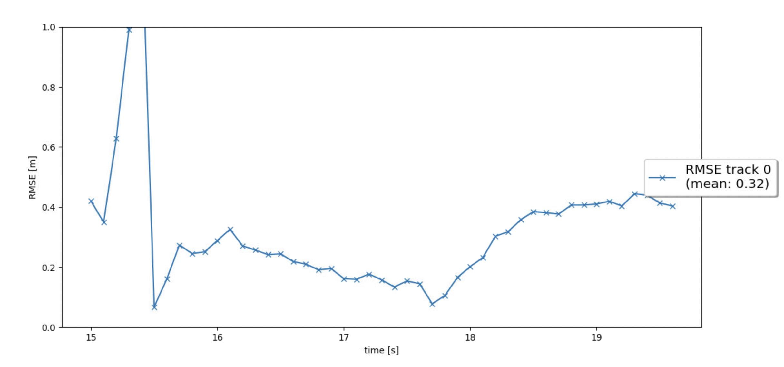
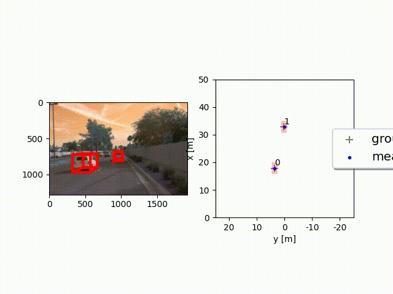
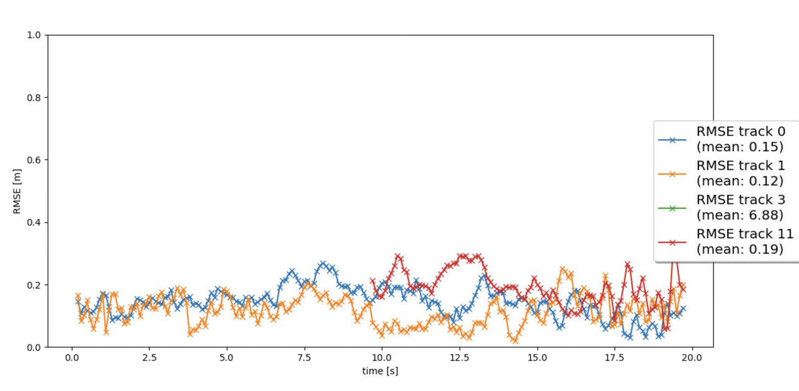

# Writeup: Track 3D-Objects Over Time

Please use this starter template to answer the following questions:

### 1. Write a short recap of the four tracking steps and what you implemented there (filter, track management, association, camera fusion). Which results did you achieve? Which part of the project was most difficult for you to complete, and why?

### Step 1: Implemented Extended Kalman Filter Algorithm (EKF) for estimation of other vehicles in 3D space.

For tracking a single vehicle, I achieved a RMSE score of 0.32

### Step 2: Track Management

Manage initialization of new detected vehicles, updating current tracks, and deleting old ones. Each track has a corresponding score value, which depicts the confidence score of the detection. 

### Step 3: Association of tracks and sensor measurements

Associate new measurements with current tracks using simple nearest neighbor to achieve multi-target tracking

### 2. Do you see any benefits in camera-lidar fusion compared to lidar-only tracking (in theory and in your concrete results)? 

### 3. Which challenges will a sensor fusion system face in real-life scenarios? Did you see any of these challenges in the project?

### 4. Can you think of ways to improve your tracking results in the future?

